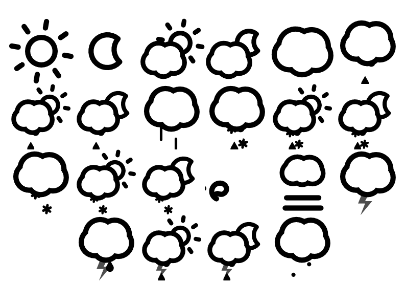
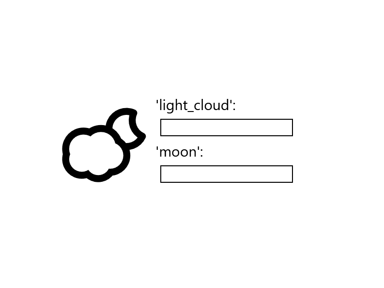

# React Skycons Extended

Easy to use react component for Skycons. Extended version with more icons from this [skycons fork](https://github.com/galdiuz/skycons) and option to colorize each part of the icon.

Created with [TSDX](https://github.com/weiran-zsd/tsdx).

## Available skycons



## Installation

Install **React-Skycons-Extended** with npm

```bash
  npm install react-skycons-extended
```

or

```bash
  yard add react-skycons-extended
```

## Demo

Check [Demo](https://codesandbox.io/s/react-skycons-extended-demo-xcp8b) to see it in action.

## Usage

```javascript
import React from 'react';
import { ReactSkycon, SkyconType } from 'react-skycons-extended';

const App = () => {
  const example = {
    icon: SkyconType.PARTLY_CLOUDY_DAY,
    size: 128,
    animate: true,
    color: {
      sun: 'darkorange', // you can use color names
      light_cloud: '#00FFFF', // or hex values
    },
    // or
    // color: "black"
    // to paint whole icon black
  };

  return (
    <div>
      <ReactSkycon
        icon={example.icon}
        color={example.color}
        size={example.size}
        animate={example.animate}
      />
    </div>
  );
};

export default App;
```

### Result


### Props

- icon: Takes a value from `SkyconType` which is:

  - CLEAR_DAY
  - CLEAR_NIGHT
  - PARTLY_CLOUDY_DAY
  - PARTLY_CLOUDY_NIGHT
  - CLOUDY
  - RAIN
  - SHOWERS_DAY
  - SHOWERS_NIGHT
  - SLEET
  - RAIN_SNOW
  - RAIN_SNOW_SHOWERS_DAY
  - RAIN_SNOW_SHOWERS_NIGHT
  - SNOW
  - SNOW_SHOWERS_DAY
  - SNOW_SHOWERS_NIGHT
  - WIND
  - FOG
  - THUNDER
  - THUNDER_RAIN
  - THUNDER_SHOWERS_DAY
  - THUNDER_SHOWERS_NIGHT
  - HAIL

- size: number value

- animate: `true` (default) if you want to animate the icon `false` if otherwise

- color: One value (either hex or named) to paint whole icon to given color or object with `ColorableParts` (see below) and its color value.

  - sun
  - moon
  - light_cloud
  - cloud
  - dark_cloud
  - rain
  - snow
  - thunder
  - wind
  - leaf
  - hail
  - sleet
  - fog

## Example of changing color of each part



## Storybook

I've added a `storybook` in the project.
To run it just type:

```bash
npm run storybook
```

or

```bash
yarn storybook
```
